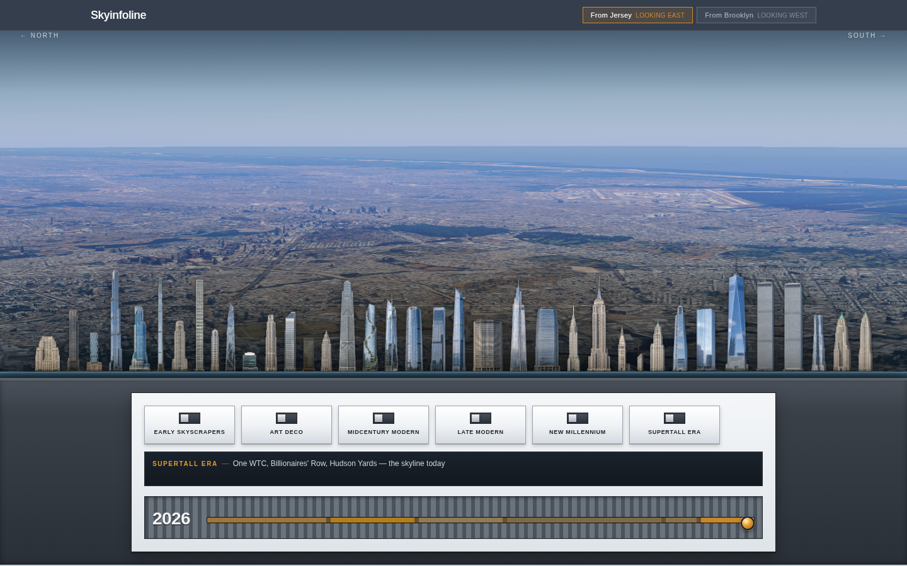

# Skyinfoline

An interactive, stylized view of the Manhattan skyline as seen from the west (Jersey City), with north on the left and south on the right. Buildings are transparent PNG cutouts stored in Sanity and scaled by height. It is a flat illustrated skyline, not a 3D city model.

Live at [skyinfoline.vercel.app](https://skyinfoline.vercel.app).



## What it does

- Click a building to open a detail panel. Left, right and Escape work from the keyboard.
- An era timeline with play and pause. Buildings appear once they are completed, and towers that no longer stand (the Twin Towers, for example) disappear after their demolition year.
- Two viewpoints: Jersey City looking east, and the Brooklyn Bridge looking west.
- Each building has a name, height, year, architect, cluster, style, nicknames, an importance value that sets its visual weight, and a skyline order.

Content is edited in Sanity Studio and published without a code deploy.

## Stack

Next.js 16 (App Router), React 19, TypeScript, Tailwind CSS 4, Sanity with an embedded Studio at `/studio`, deployed on Vercel.

## Running it locally

```sh
npm install
cp .env.example .env.local
npm run dev
```

Set these in `.env.local`:

```
NEXT_PUBLIC_SANITY_PROJECT_ID=re2nvive
NEXT_PUBLIC_SANITY_DATASET=production
NEXT_PUBLIC_SANITY_API_VERSION=2025-08-25
```

The site is at http://localhost:3000 and the Studio at http://localhost:3000/studio. Add the same variables to your Vercel project for previews and production.

## Editing buildings

1. Open the [Studio](https://skyinfoline.sanity.studio/) or `/studio` locally and sign in with Sanity.
2. Create or edit a Building document.
3. Upload a transparent PNG to the cutout field. Crop it tight to the silhouette, because empty space above a spire pushes the label away from the tower.
4. Set the skyline order (lower means further south) and, for towers that are gone, the year demolished.
5. Publish.

## Scripts

- `npm run dev` starts the site and the embedded Studio
- `npm run build` makes a production build
- `npm run lint` runs ESLint
- `npm run seed` reseeds the Manhattan buildings and uploads cutouts from `building-cutouts/`. It needs `SANITY_WRITE_TOKEN` in `.env.local`.

See `building-cutouts/README.md` for the cutout filenames the seed script expects.
